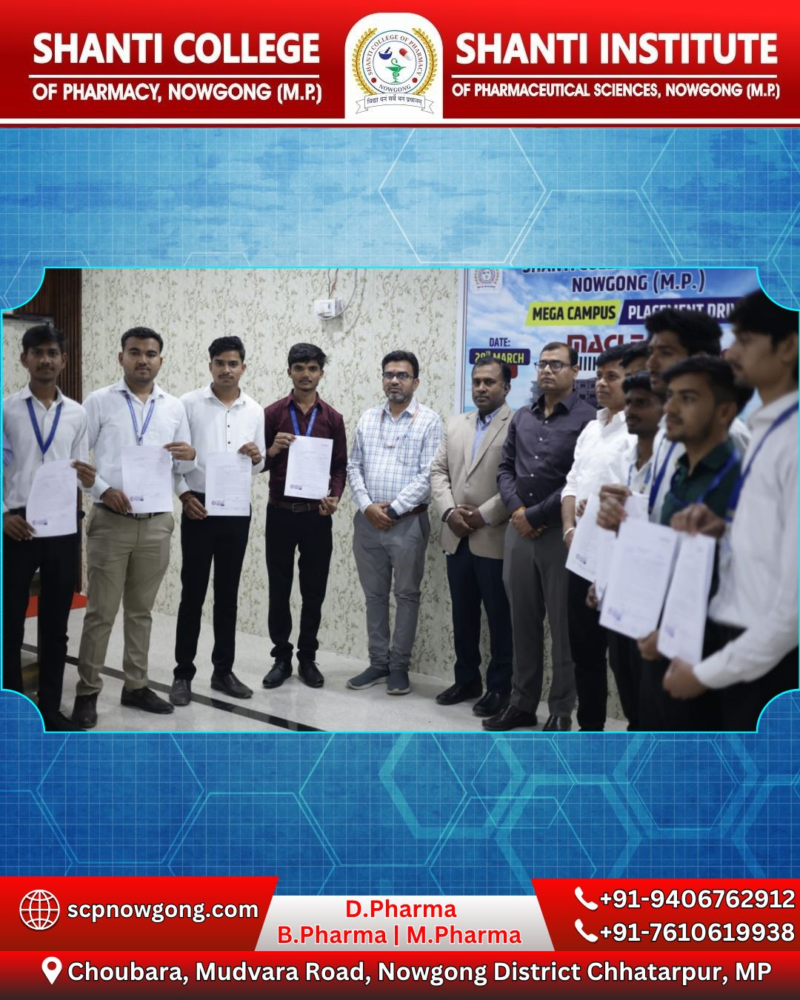
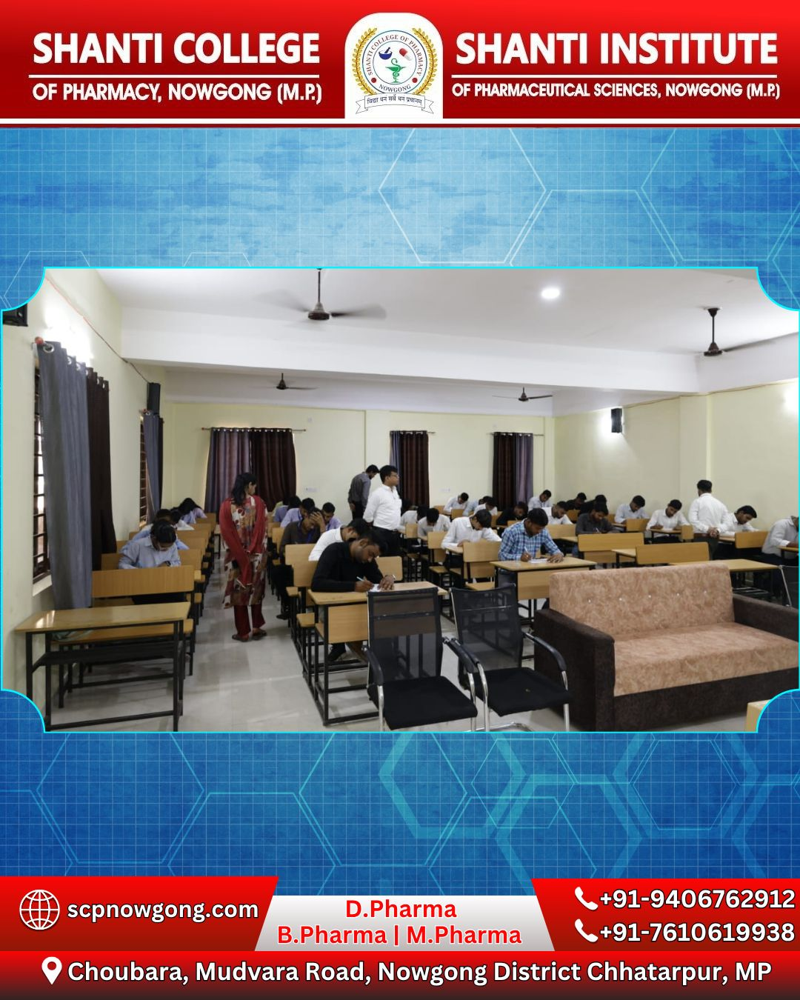
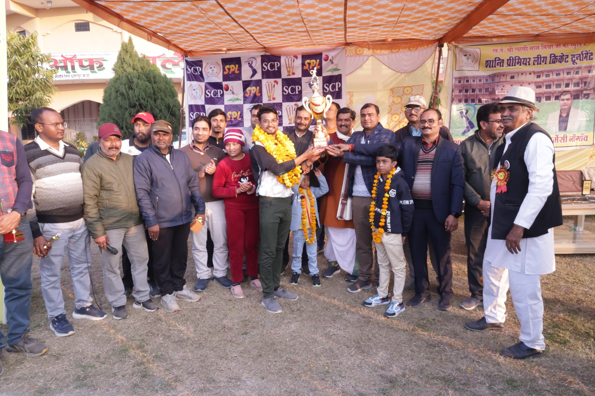

# PGSM Welfare — Master Replacement Code & Content Document
**Target Deployment:** Antigravity Project / Production Web App  
**Status:** 100% Real Client Data | Zero AI Image Dependencies | Elevated Pan-India Tone  
**Date:** September 2026  

---

## 📑 Table of Contents
1. [Image Asset Checklist & File Renaming Guide](#1-image-asset-checklist--file-renaming-guide)
2. [Global Navigation & 4-Column Footer](#2-global-navigation--4-column-footer)
3. [Page 1: Home Page (`index.html`)](#3-page-1-home-page-indexhtml)
4. [Page 2: About Us Page (`about.html`)](#4-page-2-about-us-page-abouthtml)
5. [Page 3: Programs & Initiatives Page (`programs.html`)](#5-page-3-programs--initiatives-page-programshtml)
6. [Page 4: Volunteer With Us (`volunteer.html`)](#6-page-4-volunteer-with-us-volunteerhtml)
7. [Page 5: Donate & Support (`donate.html`)](#7-page-5-donate--support-donatehtml)

---

## 1. Image Asset Checklist & File Renaming Guide

Save your client's WhatsApp photos into your project's `public/images/real/` directory with these filenames. All code blocks below reference these exact paths:

| File Name to Save As | WhatsApp Photo Source / Event | Where It Is Used in UI |
| :--- | :--- | :--- |
| `dr_ravi_kant_mishra.jpg` | Real portrait with cyan background / white shirt | Leadership Spotlight & About Page |
| `pradeep_mishra.jpg` | Real portrait in maroon kurta | Treasurer Card in About Page |
| `bhartendu_mishra.jpg` | Real portrait of Secretary Er. Bhartendu Mishra | Secretary Card in About Page |
| `hero_placement.jpg` | Macleods Pharma placement group photo with faculty | Home Page Main Hero Canvas |
| `placement_drive.jpg` | Students in written test / HR interview room | Pillar 1 & Programs Page (Education) |
| `spl_trophy.jpg` | SPL Season 6 trophy and cash prize presentation | Pillar 2 & Programs Page (Youth/Sports) |
| `health_camp_real.jpg` | Doctors checking BP/Sugar in village Choubara | Pillar 3 & Programs Page (Healthcare) |
| `nss_cleanliness.jpg` | NSS student volunteers with brooms in village | Pillar 4 & Volunteer Page |
| `tree_plantation_real.jpg` | Students planting saplings with tree guards | Pillar 5 & Environment Section |
| `pratibha_khoj.jpg` | Merit student felicitation on stage with guests | Programs Page (Scholarships) |
| `press_clipping.jpg` | *Dainik Bhaskar* newspaper article on SPL Cricket | Gallery & Media Mentions |

---

## 2. Global Navigation & 4-Column Footer

### Top Navigation Bar (Header)
```html
<header class="bg-white/95 backdrop-blur-md w-full z-50 sticky top-0 border-b border-gray-200/60 shadow-sm" id="topNav">
    <div class="flex justify-between items-center w-full px-4 sm:px-6 md:px-12 lg:px-16 max-w-[1280px] mx-auto h-20">
        <!-- Brand Logo -->
        <a class="text-xl sm:text-2xl font-black text-[#F36F21] flex items-center gap-2 tracking-tight" href="index.html">
            <span class="material-symbols-outlined text-3xl text-[#F36F21]" style="font-variation-settings: 'FILL' 1;">volunteer_activism</span>
            <span class="font-black tracking-tight text-[#a04100]">PGSM Welfare</span>
        </a>
        
        <!-- Desktop Navigation -->
        <nav class="hidden lg:flex items-center gap-6 xl:gap-8 font-bold text-sm">
            <a class="text-gray-700 hover:text-[#F36F21] transition-colors" href="about.html">About Us</a>
            <a class="text-gray-700 hover:text-[#F36F21] transition-colors" href="programs.html">Programs & Placements</a>
            <a class="text-gray-700 hover:text-[#F36F21] transition-colors" href="volunteer.html">Volunteer</a>
            <a class="text-gray-700 hover:text-[#F36F21] transition-colors" href="index.html#work">Field Impact</a>
            <a class="text-gray-700 hover:text-[#F36F21] transition-colors" href="about.html#governance">Leadership</a>
            <a class="text-gray-700 hover:text-[#F36F21] transition-colors" href="donate.html">Donate</a>
        </nav>
        
        <!-- Desktop CTA -->
        <div class="hidden lg:flex items-center gap-3">
            <a href="donate.html" class="bg-[#F36F21] text-white font-bold text-sm px-6 py-2.5 rounded-full hover:bg-[#a04100] active:scale-95 transition-all shadow-md inline-flex items-center gap-2">
                <span class="material-symbols-outlined text-sm" style="font-variation-settings: 'FILL' 1;">favorite</span>
                Donate & 80G
            </a>
        </div>
    </div>
</header>
```

### Universal 4-Column Footer & Compliance Bar
```html
<footer class="bg-[#1F1F1F] text-gray-300 border-t border-white/10 w-full relative z-20">
    <div class="grid grid-cols-1 sm:grid-cols-2 md:grid-cols-4 gap-8 px-4 sm:px-6 md:px-12 lg:px-16 py-16 max-w-[1280px] mx-auto">
        <!-- Column 1: Institutional Credibility -->
        <div class="flex flex-col gap-4">
            <a href="index.html" class="text-2xl font-black text-[#FFB693] tracking-tight flex items-center gap-2">
                <span class="material-symbols-outlined text-3xl text-[#F36F21]" style="font-variation-settings: 'FILL' 1;">volunteer_activism</span>
                PGSM Welfare
            </a>
            <p class="text-sm text-gray-300 leading-relaxed">
                Pioneering rural education-to-employment pathways, community health surveillance, and youth leadership across Central India since 2016.
            </p>
            <ul class="flex flex-col gap-2 mt-2 text-xs font-bold text-gray-200">
                <li class="flex items-center gap-2">
                    <span class="material-symbols-outlined text-[#F36F21] text-base" style="font-variation-settings: 'FILL' 1;">check_circle</span>
                    Section 80G Certified (URN: AAEAP1466C24BP02)
                </li>
                <li class="flex items-center gap-2">
                    <span class="material-symbols-outlined text-[#F36F21] text-base" style="font-variation-settings: 'FILL' 1;">check_circle</span>
                    NITI Aayog Darpan (MP/2021/0299785)
                </li>
                <li class="flex items-center gap-2">
                    <span class="material-symbols-outlined text-[#F36F21] text-base" style="font-variation-settings: 'FILL' 1;">verified</span>
                    MCA CSR Approved (Reg: CSR00007144)
                </li>
            </ul>
        </div>

        <!-- Column 2: Quick Links -->
        <div class="flex flex-col gap-4">
            <h3 class="text-lg font-bold text-[#FFB693]">Quick Links</h3>
            <nav class="flex flex-col gap-2 text-sm">
                <a class="text-gray-300 hover:text-[#F36F21] transition-colors w-max" href="about.html">About the Foundation</a>
                <a class="text-gray-300 hover:text-[#F36F21] transition-colors w-max" href="programs.html">Shanti College & Programs</a>
                <a class="text-gray-300 hover:text-[#F36F21] transition-colors w-max" href="volunteer.html">NSS Volunteer Corps</a>
                <a class="text-gray-300 hover:text-[#F36F21] transition-colors w-max" href="donate.html">Tax-Exempt Donations</a>
                <a class="text-gray-300 hover:text-[#F36F21] transition-colors w-max" href="about.html#governance">Board of Trustees</a>
                <a class="text-gray-300 hover:text-[#F36F21] transition-colors w-max" href="index.html#work">Photo Gallery & Press</a>
            </nav>
        </div>

        <!-- Column 3: Contact Details (Regulatory Office) -->
        <div class="flex flex-col gap-4">
            <h3 class="text-lg font-bold text-[#FFB693]">Registered Secretariat</h3>
            <div class="flex flex-col gap-3 text-sm text-gray-300">
                <p class="flex items-start gap-2">
                    <span class="material-symbols-outlined text-[#F36F21] text-lg shrink-0 mt-0.5">location_on</span>
                    <span>Secretariat Office, Mishra Clinic Campus, Nowgong, Madhya Pradesh – 471201</span>
                </p>
                <p class="flex items-center gap-2">
                    <span class="material-symbols-outlined text-[#F36F21] text-lg shrink-0">call</span>
                    <a href="tel:+919406762912" class="hover:text-white transition-colors">+91 94067 62912</a>
                </p>
                <p class="flex items-center gap-2">
                    <span class="material-symbols-outlined text-[#F36F21] text-lg shrink-0">mail</span>
                    <a href="mailto:psgmwelfare@gmail.com" class="hover:text-white transition-colors">psgmwelfare@gmail.com</a>
                </p>
            </div>
        </div>

        <!-- Column 4: Newsletter -->
        <div class="flex flex-col gap-4">
            <h3 class="text-lg font-bold text-[#FFB693]">Subscribe for Updates</h3>
            <p class="text-xs text-gray-400">Receive verified quarterly impact reports and field audit summaries.</p>
            <form class="flex flex-col gap-2" onsubmit="event.preventDefault(); alert('Subscribed successfully!');">
                <input class="w-full bg-white/10 border border-white/20 text-white rounded-lg px-4 py-2.5 text-sm focus:ring-2 focus:ring-[#F36F21] outline-none" placeholder="Your Email Address" type="email" required/>
                <button class="bg-[#F36F21] text-white font-bold text-sm rounded-lg px-4 py-2.5 hover:bg-[#a04100] transition-colors shadow-md" type="submit">
                    Subscribe
                </button>
            </form>
        </div>
    </div>

    <!-- Bottom Bar -->
    <div class="border-t border-white/10 bg-[#171717] py-4 px-4 text-xs text-gray-400">
        <div class="max-w-[1280px] mx-auto flex flex-col md:flex-row justify-between items-center gap-3">
            <p>© 2026 Pandit Shree Gyasi Lal Mishra Educational & Social Welfare Society. All Rights Reserved.</p>
            <p>Society Reg: 06/12/03/11718/16 | Permanent PAN: AAATP8891J</p>
        </div>
    </div>
</footer>
```

---

## 3. Page 1: Home Page (`index.html`)

### 3.1 Hero Canvas (High-Impact National Copy)
```html
<section id="hero" class="bg-[#F36F21] relative overflow-hidden pt-8 pb-20 md:pt-16 md:pb-28 px-4 sm:px-6 md:px-12 lg:px-16">
    <div class="max-w-[1280px] mx-auto grid grid-cols-1 lg:grid-cols-2 gap-10 md:gap-16 items-center relative z-10">
        <!-- Left Column -->
        <div class="flex flex-col items-start space-y-6">
            <!-- Bilingual Tagline Badge -->
            <div class="bg-[#1F1F1F] text-white text-xs sm:text-sm font-bold px-4 py-2 rounded-full inline-flex items-center gap-2 shadow-md border border-white/20 max-w-full">
                <span class="text-[#F36F21] shrink-0">✦</span>
                <span class="leading-snug">शिक्षा से सशक्त समाज, सेवा से समृद्ध राष्ट्र | Empowering Society through Education</span>
            </div>

            <!-- Longevity Badge -->
            <div class="bg-black/40 text-white font-bold text-xs px-4 py-1.5 rounded-full inline-flex items-center gap-2 border border-white/20">
                <span>🌟</span>
                <span>9+ Years of Ground Impact · Est. 2016</span>
            </div>

            <!-- Headline -->
            <h1 class="text-3xl sm:text-4xl md:text-5xl lg:text-6xl font-black text-white leading-tight">
                Empowering Rural India: From Grassroots Classrooms to High-Impact Careers
            </h1>

            <!-- Subtitle -->
            <p class="text-base sm:text-lg text-white/90 max-w-xl leading-relaxed font-normal">
                Operating higher technical institutions, rural medical clinics, and youth sports championships that transform potential into generational progress. Your partnership keeps this mission scaling.
            </p>

            <!-- Action Buttons -->
            <div class="flex flex-col sm:flex-row gap-4 pt-2 w-full sm:w-auto">
                <a href="donate.html" class="bg-white text-[#F36F21] font-extrabold text-sm sm:text-base px-8 py-4 rounded-xl flex items-center justify-center gap-2 hover:-translate-y-0.5 hover:shadow-xl transition-all shadow-md">
                    <span class="material-symbols-outlined text-xl" style="font-variation-settings: 'FILL' 1;">favorite</span>
                    Support Student Careers
                </a>
                <a href="programs.html" class="bg-[#1F1F1F] text-white font-bold text-sm sm:text-base px-8 py-4 rounded-xl flex items-center justify-center gap-2 hover:bg-black transition-all border border-white/20 shadow-md">
                    <span>Explore Programs & Placements</span>
                    <span class="material-symbols-outlined text-xl">arrow_forward</span>
                </a>
            </div>

            <!-- Trust Strip -->
            <div class="pt-4 flex flex-wrap items-center gap-x-4 gap-y-2 text-xs font-semibold text-white/80">
                <span class="flex items-center gap-1">
                    <span class="material-symbols-outlined text-sm">check</span>
                    Registered Society (06/12/03/11718/16)
                </span>
                <span>|</span>
                <span class="flex items-center gap-1">
                    <span class="material-symbols-outlined text-sm">check</span>
                    100% Tax Exemption 80G
                </span>
                <span>|</span>
                <span class="flex items-center gap-1">
                    <span class="material-symbols-outlined text-sm">check</span>
                    CSR Approved (CSR00007144)
                </span>
            </div>
        </div>

        <!-- Right Column: Real Photo Frame -->
        <div class="relative w-full max-w-lg mx-auto lg:mx-0 lg:ml-auto">
            <div class="aspect-[4/3] rounded-2xl border-8 border-white overflow-hidden shadow-2xl bg-gray-100 relative z-10">
                
            </div>
            <!-- Floating Placement Stat Card -->
            <div class="absolute -bottom-6 -left-4 sm:-left-8 z-20 bg-[#1F1F1F] rounded-2xl p-5 shadow-2xl border border-white/10 text-center">
                <span class="text-3xl sm:text-4xl font-black text-[#F36F21]">25+</span>
                <span class="text-white text-[11px] font-bold block uppercase tracking-wider mt-1">Corporate Job Offers</span>
                <span class="text-gray-400 text-[10px] block">Macleods Pharmaceuticals (2026)</span>
            </div>
        </div>
    </div>

    <!-- 3.2 Real Event Impact Highlights Bar -->
    <div class="max-w-[1280px] mx-auto mt-14 relative z-10">
        <div class="flex items-center gap-2 mb-4 text-white font-bold text-xs uppercase tracking-wider">
            <span class="material-symbols-outlined text-white text-base" style="font-variation-settings: 'FILL' 1;">auto_awesome</span>
            <span>2026 Ground Milestones & Impact Highlights</span>
        </div>
        <div class="grid grid-cols-1 sm:grid-cols-2 lg:grid-cols-4 gap-4">
            <!-- Milestone 1 -->
            <div class="bg-black/40 backdrop-blur-md border border-white/20 rounded-2xl p-5 flex flex-col justify-between gap-3 text-white hover:border-white transition-all">
                <div class="flex items-center justify-between">
                    <span class="bg-[#F36F21] text-white text-[10px] font-extrabold uppercase px-2.5 py-0.5 rounded-full">25 Confirmed Offers</span>
                    <span class="material-symbols-outlined text-white text-lg">school</span>
                </div>
                <div>
                    <h4 class="font-bold text-sm text-white leading-snug">Macleods Pharma Mega Placement Drive</h4>
                    <p class="text-xs text-white/80 mt-1 leading-relaxed">Multi-round hiring drive securing 25 industrial appointments for rural pharmacy graduates in Indore & Baddi.</p>
                </div>
            </div>

            <!-- Milestone 2 -->
            <div class="bg-black/40 backdrop-blur-md border border-white/20 rounded-2xl p-5 flex flex-col justify-between gap-3 text-white hover:border-white transition-all">
                <div class="flex items-center justify-between">
                    <span class="bg-[#F36F21] text-white text-[10px] font-extrabold uppercase px-2.5 py-0.5 rounded-full">Season-6 Finals</span>
                    <span class="material-symbols-outlined text-white text-lg">sports_cricket</span>
                </div>
                <div>
                    <h4 class="font-bold text-sm text-white leading-snug">Shanti Premier League (SPL) Championship</h4>
                    <p class="text-xs text-white/80 mt-1 leading-relaxed">Regional youth sports tournament awarding ₹8,000 cash prizes, covered by Dainik Bhaskar & Nai Dunia.</p>
                </div>
            </div>

            <!-- Milestone 3 -->
            <div class="bg-black/40 backdrop-blur-md border border-white/20 rounded-2xl p-5 flex flex-col justify-between gap-3 text-white hover:border-white transition-all">
                <div class="flex items-center justify-between">
                    <span class="bg-[#F36F21] text-white text-[10px] font-extrabold uppercase px-2.5 py-0.5 rounded-full">Village Adoption</span>
                    <span class="material-symbols-outlined text-white text-lg">groups</span>
                </div>
                <div>
                    <h4 class="font-bold text-sm text-white leading-snug">7-Day NSS Rural Immersion Camp</h4>
                    <p class="text-xs text-white/80 mt-1 leading-relaxed">Residential youth camp in Gram Choubara conducting human rights lectures, Swachh Bharat, and vitals screening.</p>
                </div>
            </div>

            <!-- Milestone 4 -->
            <div class="bg-black/40 backdrop-blur-md border border-white/20 rounded-2xl p-5 flex flex-col justify-between gap-3 text-white hover:border-white transition-all">
                <div class="flex items-center justify-between">
                    <span class="bg-[#F36F21] text-white text-[10px] font-extrabold uppercase px-2.5 py-0.5 rounded-full">Scholarships</span>
                    <span class="material-symbols-outlined text-white text-lg">military_tech</span>
                </div>
                <div>
                    <h4 class="font-bold text-sm text-white leading-snug">Shanti Pratibha Khoj & Board Merit Honors</h4>
                    <p class="text-xs text-white/80 mt-1 leading-relaxed">Annual state talent exam awarding cash prizes (₹5,100) and honoring 60%+ 12th-grade board toppers.</p>
                </div>
            </div>
        </div>
    </div>
</section>
```

---

## 4. Page 2: About Us Page (`about.html`)

### 4.1 Executive Board (3 Key Leaders as Explicitly Instructed by Client)
```html
<section id="governance" class="py-20 px-4 sm:px-6 md:px-12 lg:px-16 bg-white">
    <div class="max-w-[1280px] mx-auto">
        <div class="text-center max-w-3xl mx-auto mb-16">
            <span class="text-[#F36F21] font-bold text-xs uppercase tracking-widest bg-[#F36F21]/10 px-4 py-1.5 rounded-full">
                Institutional Governance
            </span>
            <h2 class="text-3xl sm:text-4xl font-extrabold text-[#1F1F1F] mt-3 mb-4">
                Executive Leadership & Board of Trustees
            </h2>
            <p class="text-gray-600 text-base">
                Steering the society's higher-education campuses and healthcare outreach with transparent, ground-level accountability.
            </p>
        </div>

        <div class="grid grid-cols-1 md:grid-cols-3 gap-8 max-w-5xl mx-auto">
            <!-- Leader 1: President -->
            <div class="bg-[#FFF7F2] rounded-2xl p-8 flex flex-col items-center text-center border border-gray-100 shadow-sm hover:shadow-md transition-all">
                <div class="w-32 h-32 rounded-full overflow-hidden border-4 border-[#F36F21] mb-5 shadow-md">
                    
                </div>
                <h3 class="text-xl font-bold text-[#1F1F1F]">Dr. Ravi Kant Mishra</h3>
                <span class="bg-[#F36F21] text-white text-xs font-bold px-3 py-1 rounded-full uppercase mt-2 mb-3">President of Society</span>
                <p class="text-xs text-gray-500 font-semibold mb-3">Physician & Institutional Founder</p>
                <p class="text-xs text-gray-600 italic leading-relaxed">
                    "Our covenant is to ensure no rural student is denied a technical career due to lack of local institutional access."
                </p>
            </div>

            <!-- Leader 2: Treasurer -->
            <div class="bg-[#FFF7F2] rounded-2xl p-8 flex flex-col items-center text-center border border-gray-100 shadow-sm hover:shadow-md transition-all">
                <div class="w-32 h-32 rounded-full overflow-hidden border-4 border-[#F36F21] mb-5 shadow-md">
                    
                </div>
                <h3 class="text-xl font-bold text-[#1F1F1F]">Shri Pradeep Kumar Mishra</h3>
                <span class="bg-[#1F1F1F] text-white text-xs font-bold px-3 py-1 rounded-full uppercase mt-2 mb-3">Treasurer of Society</span>
                <p class="text-xs text-gray-500 font-semibold mb-3">Financial Governance & Administration</p>
                <p class="text-xs text-gray-600 italic leading-relaxed">
                    "100% of received philanthropic and institutional capital is audited and deployed into classroom facilities and free diagnostics."
                </p>
            </div>

            <!-- Leader 3: Secretary -->
            <div class="bg-[#FFF7F2] rounded-2xl p-8 flex flex-col items-center text-center border border-gray-100 shadow-sm hover:shadow-md transition-all">
                <div class="w-32 h-32 rounded-full overflow-hidden border-4 border-[#F36F21] mb-5 shadow-md">
                    
                </div>
                <h3 class="text-xl font-bold text-[#1F1F1F]">Er. Bhartendu Mishra</h3>
                <span class="bg-[#F36F21] text-white text-xs font-bold px-3 py-1 rounded-full uppercase mt-2 mb-3">Secretary & Director</span>
                <p class="text-xs text-gray-500 font-semibold mb-3">Director, Shanti Group & Youth Programs</p>
                <p class="text-xs text-gray-600 italic leading-relaxed">
                    "From campus placement drives to sports tournaments, our focus is transforming young energy into nation-building power."
                </p>
            </div>
        </div>
    </div>
</section>
```

---

## 5. Page 3: Programs & Initiatives Page (`programs.html`)

### 5.1 Real Event Program Stack
```html
<!-- Real Program 1: Technical Pharmacy Education & Macleods Drive -->
<section id="pharmacy" class="py-16 px-4 sm:px-6 md:px-12 lg:px-16 bg-white border-b border-gray-100">
    <div class="max-w-[1280px] mx-auto grid grid-cols-1 lg:grid-cols-2 gap-12 items-center">
        <div>
            <span class="text-[#F36F21] font-bold text-xs uppercase tracking-widest bg-[#FFF2EB] px-3.5 py-1 rounded-full">
                Employment-Linked Education
            </span>
            <h2 class="text-3xl sm:text-4xl font-extrabold text-[#1F1F1F] mt-3 mb-4">
                Higher Technical Pharmacy Education & Corporate Campus Recruitment
            </h2>
            <p class="text-gray-600 text-sm sm:text-base leading-relaxed mb-4">
                Operated by the society, **Shanti College of Pharmacy** imparts professional D.Pharm and B.Pharm curricula recognized by the Pharmacy Council of India (PCI). Beyond classroom pedagogy, the institute actively guarantees campus placement opportunities.
            </p>
            <div class="bg-[#FFF7F2] p-4 rounded-xl border border-[#F36F21]/20 mb-6">
                <h4 class="font-bold text-sm text-[#1F1F1F] mb-1">Recent Campus Placement Drive Milestone (28 March 2026):</h4>
                <p class="text-xs text-gray-700 leading-relaxed">
                    Organized in direct collaboration with **Macleods Pharmaceuticals Ltd.** (HR COE Indore team). Out of 100 student aspirants, 45 cleared Round 1, resulting in **25 verified job offer appointments** across industrial manufacturing units in Indore & Baddi.
                </p>
            </div>
            <div class="flex gap-4">
                <a href="donate.html" class="bg-[#F36F21] text-white font-bold text-sm px-6 py-3 rounded-xl hover:bg-[#a04100] transition-colors">
                    Sponsor a Student's Semester Fee
                </a>
            </div>
        </div>
        <div class="rounded-2xl overflow-hidden shadow-xl border-4 border-gray-100 aspect-[4/3]">
            
        </div>
    </div>
</section>

<!-- Real Program 2: Shanti Premier League & Youth Sports -->
<section id="sports-nss" class="py-16 px-4 sm:px-6 md:px-12 lg:px-16 bg-[#FFF7F2] border-b border-gray-100">
    <div class="max-w-[1280px] mx-auto grid grid-cols-1 lg:grid-cols-2 gap-12 items-center">
        <div class="order-2 lg:order-1 rounded-2xl overflow-hidden shadow-xl border-4 border-white aspect-[4/3]">
            
        </div>
        <div class="order-1 lg:order-2">
            <span class="text-[#F36F21] font-bold text-xs uppercase tracking-widest bg-white px-3.5 py-1 rounded-full shadow-sm">
                Youth Cohesion & Sportsmanship
            </span>
            <h2 class="text-3xl sm:text-4xl font-extrabold text-[#1F1F1F] mt-3 mb-4">
                Shanti Premier League (SPL) & Civic Sports Development
            </h2>
            <p class="text-gray-600 text-sm sm:text-base leading-relaxed mb-4">
                Sports are an essential vehicle for channelizing youth energy, cultivating discipline, and breaking rural social barriers. The society annually organizes the high-stakes **Shanti Premier League (SPL)** cricket championship.
            </p>
            <div class="bg-white p-4 rounded-xl border border-gray-200 mb-6 shadow-sm">
                <h4 class="font-bold text-sm text-[#1F1F1F] mb-1">SPL Season-6 Grand Finale Highlights (10 Jan 2026):</h4>
                <p class="text-xs text-gray-700 leading-relaxed">
                    Final match witnessed a thrilling 12-over clash between B.Pharm 7th Semester (Winners) and M.Pharm (Runners-up). Cash awards of ₹8,000 and ₹4,000 distributed on stage in the presence of distinguished state media journalists and dignitaries. Covered by *Dainik Bhaskar* and *Nai Dunia*.
                </p>
            </div>
            <a href="volunteer.html" class="bg-[#1F1F1F] text-white font-bold text-sm px-6 py-3 rounded-xl hover:bg-black transition-colors inline-block">
                Join as a Sports Volunteer
            </a>
        </div>
    </div>
</section>
```

---

## 6. Page 4: Volunteer With Us (`volunteer.html`)

### 6.1 Real NSS Village Immersion Volunteer Roles
```html
<section id="volunteer-roles" class="py-20 px-4 sm:px-6 md:px-12 lg:px-16 bg-white">
    <div class="max-w-[1280px] mx-auto">
        <div class="text-center max-w-3xl mx-auto mb-16">
            <span class="text-[#F36F21] font-bold text-xs uppercase tracking-widest bg-[#FFF2EB] px-4 py-1.5 rounded-full">
                Direct Field Opportunities
            </span>
            <h2 class="text-3xl sm:text-4xl font-extrabold text-[#1F1F1F] mt-3 mb-4">
                Join the PGSM & NSS Field Volunteer Corps
            </h2>
            <p class="text-gray-600 text-base">
                Participate in verified grassroots camps and receive official institutional and NSS service certificates.
            </p>
        </div>

        <div class="grid grid-cols-1 md:grid-cols-3 gap-8">
            <!-- Role 1 -->
            <div class="border border-gray-200 rounded-2xl p-6 flex flex-col justify-between hover:border-[#F36F21] transition-all group">
                <div>
                    <span class="material-symbols-outlined text-4xl text-[#F36F21] mb-4">clinical_notes</span>
                    <h3 class="text-xl font-bold text-[#1F1F1F] mb-2">Health Camp Diagnostic Assistant</h3>
                    <p class="text-sm text-gray-600 leading-relaxed mb-4">
                        Assist doctors in recording patient vitals, organizing free blood pressure and sugar screening desks in adopted villages (Gram Choubara).
                    </p>
                </div>
                <span class="text-xs font-bold text-[#F36F21] uppercase">Time Commitment: Weekend Camps</span>
            </div>

            <!-- Role 2 -->
            <div class="border border-gray-200 rounded-2xl p-6 flex flex-col justify-between hover:border-[#F36F21] transition-all group">
                <div>
                    <span class="material-symbols-outlined text-4xl text-[#F36F21] mb-4">cleaning_services</span>
                    <h3 class="text-xl font-bold text-[#1F1F1F] mb-2">NSS Swachh Bharat Field Leader</h3>
                    <p class="text-sm text-gray-600 leading-relaxed mb-4">
                        Lead 7-day village immersion cohorts conducting street sanitation, plastic eradication campaigns, and constitutional rights seminars.
                    </p>
                </div>
                <span class="text-xs font-bold text-[#F36F21] uppercase">Time Commitment: 7-Day Residential Camp</span>
            </div>

            <!-- Role 3 -->
            <div class="border border-gray-200 rounded-2xl p-6 flex flex-col justify-between hover:border-[#F36F21] transition-all group">
                <div>
                    <span class="material-symbols-outlined text-4xl text-[#F36F21] mb-4">sports_cricket</span>
                    <h3 class="text-xl font-bold text-[#1F1F1F] mb-2">Sports & Youth Event Coordinator</h3>
                    <p class="text-sm text-gray-600 leading-relaxed mb-4">
                        Coordinate matches, umpiring, and logistics for the annual Shanti Premier League (SPL) and National Youth Day events.
                    </p>
                </div>
                <span class="text-xs font-bold text-[#F36F21] uppercase">Time Commitment: Tournament Weeks</span>
            </div>
        </div>
    </div>
</section>
```

---

## 7. Page 5: Donate & Support (`donate.html`)

### 7.1 Verified Regulatory & Direct Bank Channels
```html
<section id="ways-to-give" class="py-16 px-4 sm:px-6 md:px-12 lg:px-16 bg-[#FFF7F2]">
    <div class="max-w-[1280px] mx-auto grid grid-cols-1 lg:grid-cols-2 gap-12">
        <!-- Left: Quick UPI & QR -->
        <div class="bg-white p-8 rounded-2xl border border-gray-200 shadow-sm flex flex-col items-center text-center">
            <span class="text-[#F36F21] font-bold text-xs uppercase tracking-widest bg-[#FFF2EB] px-3 py-1 rounded-full mb-3">Instant Giving</span>
            <h3 class="text-2xl font-bold text-[#1F1F1F] mb-2">Scan & Pay via UPI</h3>
            <p class="text-xs text-gray-500 mb-6">Supports PhonePe, Google Pay, Paytm, BHIM & All Major Banks</p>
            
            <!-- Branded QR Frame -->
            <div class="w-56 h-56 border-4 border-[#F36F21] rounded-2xl p-3 bg-white flex items-center justify-center shadow-md mb-4">
                
            </div>
            <p class="text-sm font-black text-[#1F1F1F]">UPI ID: <span class="text-[#F36F21]">psgmwelfare@icici</span></p>
            <p class="text-xs text-gray-500 mt-1">Beneficiary: Pandit Shree Gyasi Lal Mishra Society</p>
        </div>

        <!-- Right: Official Verified Bank Details (From Audit Report) -->
        <div class="bg-white p-8 rounded-2xl border border-gray-200 shadow-sm flex flex-col justify-between">
            <div>
                <span class="text-[#1F1F1F] font-bold text-xs uppercase tracking-widest bg-gray-100 px-3 py-1 rounded-full mb-3 inline-block">Direct Bank Transfer</span>
                <h3 class="text-2xl font-bold text-[#1F1F1F] mb-2">NEFT / RTGS / IMPS Details</h3>
                <p class="text-xs text-gray-500 mb-6">For Institutional, CSR, and High-Value Philanthropic Grants</p>
                
                <div class="space-y-3 bg-[#FBF9F9] p-5 rounded-xl border border-gray-200 text-sm">
                    <div class="flex justify-between border-b border-gray-200 pb-2">
                        <span class="text-gray-500">Account Name:</span>
                        <strong class="text-[#1F1F1F] text-right text-xs sm:text-sm">Pandit Shree Gyasi Lal Mishra Education & Social Welfare Society</strong>
                    </div>
                    <div class="flex justify-between border-b border-gray-200 pb-2">
                        <span class="text-gray-500">Bank Name:</span>
                        <strong class="text-[#1F1F1F]">ICICI Bank Ltd.</strong>
                    </div>
                    <div class="flex justify-between border-b border-gray-200 pb-2">
                        <span class="text-gray-500">Account Number:</span>
                        <strong class="text-[#F36F21] font-mono text-base">725901000248</strong>
                    </div>
                    <div class="flex justify-between border-b border-gray-200 pb-2">
                        <span class="text-gray-500">IFSC Code:</span>
                        <strong class="text-[#1F1F1F] font-mono">ICIC0007259</strong>
                    </div>
                    <div class="flex justify-between">
                        <span class="text-gray-500">Branch Address:</span>
                        <span class="text-[#1F1F1F] text-right text-xs">Banglow No. 15, Chhatarpur Road, Nowgong Branch</span>
                    </div>
                </div>
            </div>

            <!-- Tax Cert Proof -->
            <div class="mt-6 pt-4 border-t border-gray-100 flex items-center justify-between text-xs text-gray-600 font-medium">
                <span>Section 80G URN: <strong>AAEAP1466C24BP02</strong></span>
                <span>Section 12A URN: <strong>AAEAP1466C25BP01</strong></span>
            </div>
        </div>
    </div>
</section>
```
